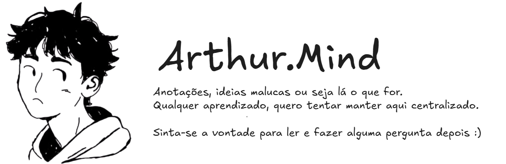

# Mente Secundária

Repositório com o foco de armazenar meus estudos recentes como se fosse uma mente secundária e disponibilizar esses materiais para quem tiver interesse.

## Tópicos Abordados

<b>Behavior Driven Development (BDD)</b>

 

Essa parte concentra-se em entender o conceito de desenvolvimento orientado por comportamento, onde o foco é descrever um cenário da história do usuário para transformá-lo em funcionalidade.

<b>Docker</b>

 

*(Conteúdo em desenvolvimento)*

<b>Event Sourcing</b>

 

*(Conteúdo em desenvolvimento)*

<b>Laravel Design Pattern</b>

 

*(Conteúdo em desenvolvimento)*

